## What is this?
This is an assigment for module 5 of my Certificate in Machine Learning and Artificial Intelligence

The details of the assignment are below.

---

### Will a Customer Accept the Coupon?

**Context**

Imagine driving through town and a coupon is delivered to your cell phone for a restaraunt near where you are driving. Would you accept that coupon and take a short detour to the restaraunt? Would you accept the coupon but use it on a sunbsequent trip? Would you ignore the coupon entirely? What if the coupon was for a bar instead of a restaraunt? What about a coffee house? Would you accept a bar coupon with a minor passenger in the car? What about if it was just you and your partner in the car? Would weather impact the rate of acceptance? What about the time of day?

Obviously, proximity to the business is a factor on whether the coupon is delivered to the driver or not, but what are the factors that determine whether a driver accepts the coupon once it is delivered to them? How would you determine whether a driver is likely to accept a coupon?

**Overview**

The goal of this project is to use what you know about visualizations and probability distributions to distinguish between customers who accepted a driving coupon versus those that did not.

**Data**

This data comes to us from the UCI Machine Learning repository and was collected via a survey on Amazon Mechanical Turk. The survey describes different driving scenarios including the destination, current time, weather, passenger, etc., and then ask the person whether he will accept the coupon if he is the driver. Answers that the user will drive there ‘right away’ or ‘later before the coupon expires’ are labeled as ‘Y = 1’ and answers ‘no, I do not want the coupon’ are labeled as ‘Y = 0’.  There are five different types of coupons -- less expensive restaurants (under \\$20), coffee houses, carry out & take away, bar, and more expensive restaurants (\\$20 - \\$50). 

**Deliverables**

Your final product should be a brief report that highlights the differences between customers who did and did not accept the coupons.  To explore the data you will utilize your knowledge of plotting, statistical summaries, and visualization using Python. You will publish your findings in a public facing github repository as your first portfolio piece. 

### Data Description
Keep in mind that these values mentioned below are average values.

The attributes of this data set include:
1. User attributes
    -  Gender: male, female
    -  Age: below 21, 21 to 25, 26 to 30, etc.
    -  Marital Status: single, married partner, unmarried partner, or widowed
    -  Number of children: 0, 1, or more than 1
    -  Education: high school, bachelors degree, associates degree, or graduate degree
    -  Occupation: architecture & engineering, business & financial, etc.
    -  Annual income: less than \\$12500, \\$12500 - \\$24999, \\$25000 - \\$37499, etc.
    -  Number of times that he/she goes to a bar: 0, less than 1, 1 to 3, 4 to 8 or greater than 8
    -  Number of times that he/she buys takeaway food: 0, less than 1, 1 to 3, 4 to 8 or greater
    than 8
    -  Number of times that he/she goes to a coffee house: 0, less than 1, 1 to 3, 4 to 8 or
    greater than 8
    -  Number of times that he/she eats at a restaurant with average expense less than \\$20 per
    person: 0, less than 1, 1 to 3, 4 to 8 or greater than 8
    -  Number of times that he/she goes to a bar: 0, less than 1, 1 to 3, 4 to 8 or greater than 8
    

2. Contextual attributes
    - Driving destination: home, work, or no urgent destination
    - Location of user, coupon and destination: we provide a map to show the geographical
    location of the user, destination, and the venue, and we mark the distance between each
    two places with time of driving. The user can see whether the venue is in the same
    direction as the destination.
    - Weather: sunny, rainy, or snowy
    - Temperature: 30F, 55F, or 80F
    - Time: 10AM, 2PM, or 6PM
    - Passenger: alone, partner, kid(s), or friend(s)


3. Coupon attributes
    - time before it expires: 2 hours or one day
---
View the Jupyter Notebook for the full analysis

---
### My research and findings

Started by investigating and cleaning the data; removing the null and otherwise unhelpful data

```python
data.isna().sum()
---
destination                 0
passanger                   0
weather                     0
temperature                 0
time                        0
coupon                      0
expiration                  0
gender                      0
age                         0
maritalStatus               0
has_children                0
education                   0
occupation                  0
income                      0
car                     12576
Bar                       107
CoffeeHouse               217
CarryAway                 151
RestaurantLessThan20      130
Restaurant20To50          189
toCoupon_GEQ5min            0
toCoupon_GEQ15min           0
toCoupon_GEQ25min           0
direction_same              0
direction_opp               0
Y                           0
dtype: int64
```

Remove the duplicates
```python
data = data.drop_duplicates()
```

I chose to replace missing data with 'other' because I didn't want to assume the person providing the data meant 'never' or another measurement. I then simply factored in 'other' as an ambiguous factor to limit the impact on my analysis.

```python
data['car'].fillna('other', inplace=True)
data['Bar'].fillna('other', inplace=True)
data['CoffeeHouse'].fillna('other', inplace=True)
data['CarryAway'].fillna('other', inplace=True)
data['RestaurantLessThan20'].fillna('other', inplace=True)
data['Restaurant20To50'].fillna('other', inplace=True)
```

I then wanted to simply see how many of the participants actually accepted the coupons.

```python
accepted_coupons = data[data['Y'] == 1]
rejected_coupons = data[data['Y'] == 0]
proportion_accepted = len(accepted_coupons) / len(data)
proportion_rejected = len(rejected_coupons) / len(data)
proportion_rejected
proportion_accepted

0.5675654242664552
```

Going further, let's see what the coupons were for and their ratio of acceptance.

```python
coupon_figure = sns.barplot(data=data, x='coupon', y='Y', hue='coupon')
coupon_figure.set_xticks(coupon_figure.get_xticks())
coupon_figure.set_xticklabels(coupon_figure.get_xticklabels(), rotation=45)
coupon_figure.set_title('Proportion of Accepted Coupons by Type')
plt.xlabel('Coupon Type')
plt.ylabel('Accepted Coupons')
plt.show()
```

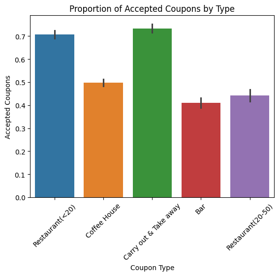

How does temperature impact the coupons offers?

```python
temperature_figure_total = sns.histplot(data=data, x='temperature', hue='coupon', multiple='stack')
temperature_figure_total.set_title('Current Temperature When Coupon Offered')
plt.xlabel('Temperature')
plt.ylabel('Total Coupons')
plt.legend(title='Coupon Type', loc='upper left', labels=['Restaurant \\$20 to $50', 'Bar', 'Carryout & Take away', 'Coffee House', 'Restaurant less than \\$20' ])
```

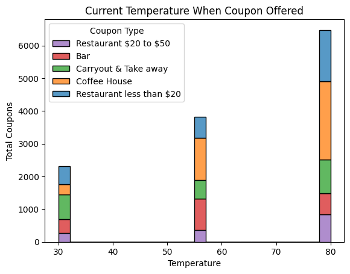

It appears that more coupons were offered in warmer temperatures.

And in the figure below, you can see the same relationship with accepting coupons.
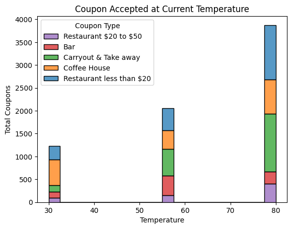

Although the same goes for rejecting coupons:
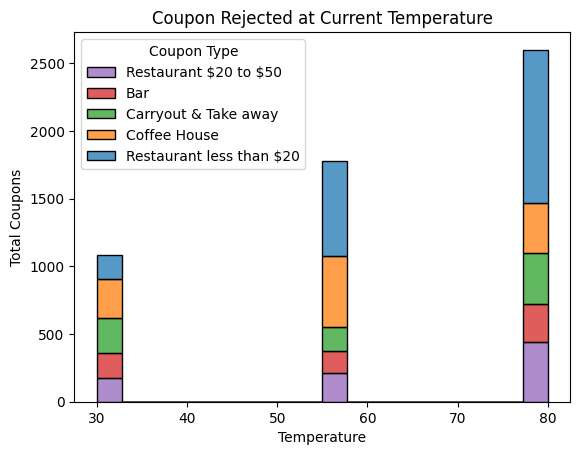
There were simply more coupons to accept or reject.

I then focused in on just those coupons that were targeting bars and counted the values of those who received such coupons and their propensity to frequent bars.

```python
only_bars = data[data['coupon']=='Bar'].drop(columns=['CoffeeHouse', 'CarryAway','RestaurantLessThan20', 'Restaurant20To50'])
only_bars['Bar'].value_counts()

Bar
never    830
less1    563
1~3      397
4~8      150
gt8       49
other     21
Name: count, dtype: int64
```

What is the ratio of those accepting coupons to bars and those that do not?

```python
bars_accepted = only_bars[only_bars['Y']==1]
bars_rejected = only_bars[only_bars['Y']==0]
bars_proportion_accepted = len(bars_accepted) / len(only_bars)
bars_proportion_rejected = len(bars_rejected) / len(only_bars)
bars_proportion_accepted

0.4099502487562189
```

I then looked at the acceptance rate of those that accepted coupons less than 3 times per month and those that accepted more than 3 times per month

```python
def less_or_greater_than_three(row):
    if row['Bar'] == 'less1' or row['Bar'] == '1~3':
        return 'less_than_3'
    else:
        return 'greater_than_3'
    
only_bars['ratio_bars'] = only_bars.apply(lambda row: less_or_greater_than_three(row), axis=1)

ratio_bars_figure = sns.barplot(data=only_bars, x='ratio_bars', y='Y', hue='ratio_bars')
ratio_bars_figure.set_yticks(np.arange(0,.7,.1))
ratio_bars_figure.set_title('Proportion of Accepted Coupons by Visit Frequency')
plt.xlabel('Visit Frequency')
plt.ylabel('Accepted Coupons')
plt.show()
```

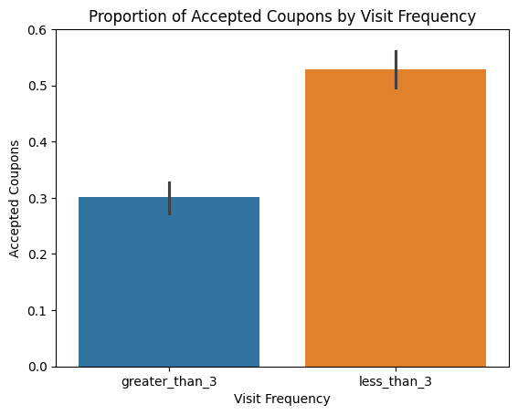

It appears that those who visit bars frequently accept coupons less frequently. Perhaps this is due to the coupon's designated bar not being the bar the prefer to frequent.

I then looked at various relationships of those that attend bars. Here's one of the more complex ones:

Those who:
- go to bars more than once a month, had passengers that were not a kid, and were not widowed *OR*
- go to bars more than once a month and are under the age of 30 *OR*
- go to cheap restaurants more than 4 times a month and income is less than 50K. 

```python
complex_bar_goers = only_bars.query('((Bar != "never" and Bar != "less1") and passanger != "Kids(s)" and maritalStatus != "Widowed") or ((Bar != "never" and Bar != "less1") and age < "30")')
cheap_restaurant_goers = data.query('(RestaurantLessThan20 == "4~8" or RestaurantLessThan20 == "gt8") and (income == "Less than $12500" or income == "$12500 - $24999" or income == "$25000 - $37499" or income == "$37500 - $49999")')
complex_relationships = pd.concat([complex_bar_goers, cheap_restaurant_goers]).drop_duplicates(keep=False)
complex_relationships = complex_relationships.query('Bar != "never" and Bar != "other"')
complex_relationships_accepted = complex_relationships[complex_relationships['Y'] == 1]
complex_relationships_rejected = complex_relationships[complex_relationships['Y'] == 0]
complex_relationships_figure = sns.barplot(data=complex_relationships, x='Bar', y='Y', hue='Bar') 
complex_relationships_figure.set_yticks(np.arange(0,1,.1))
complex_relationships_figure.set_title('People in a complex query who accepted coupons')
complex_relationships_figure.set_xticklabels(complex_relationships_figure.get_xticklabels(), rotation=45)
plt.xlabel('Coupon Type')
plt.ylabel('Acceptance Rate')
plt.show()
```

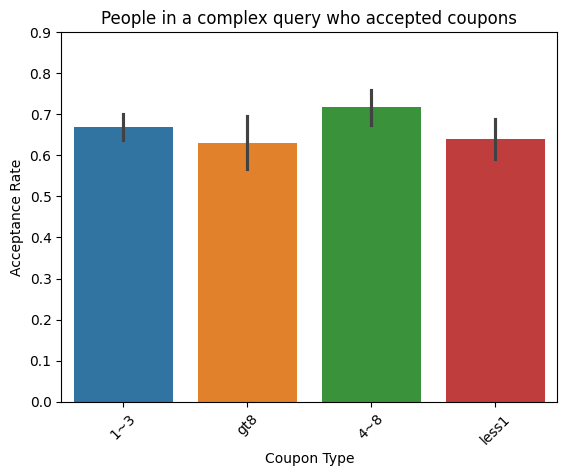

## Conclusions
Across all these queries, the likelihood of a driver who already frequents bars is more likely to accept a coupon to go to a bar. However, it looks like the more a driver frequents a bar the few coupons they will accepts. Perhaps this is because these drivers have a favorite bar they go to and coupons are for other bars.

#### Clean up the data
Removing measurements I'm not particularly interested in or curious about. This just makes the data set a bit easier to see what we're working with.

```python
limited_only_bars = only_bars.drop(columns=['weather', 'temperature', 'time', 'car', 'Bar', 'toCoupon_GEQ5min', 'toCoupon_GEQ15min', 'toCoupon_GEQ25min', 'ratio_bars']).rename(columns={'Y': 'accepted'})
limited_only_bars.info()


<class 'pandas.core.frame.DataFrame'>
Index: 2010 entries, 9 to 12682
Data columns (total 14 columns):
 #   Column          Non-Null Count  Dtype 
---  ------          --------------  ----- 
 0   destination     2010 non-null   object
 1   passanger       2010 non-null   object
 2   coupon          2010 non-null   object
 3   expiration      2010 non-null   object
 4   gender          2010 non-null   object
 5   age             2010 non-null   object
 6   maritalStatus   2010 non-null   object
 7   has_children    2010 non-null   int64 
 8   education       2010 non-null   object
 9   occupation      2010 non-null   object
 10  income          2010 non-null   object
 11  direction_same  2010 non-null   int64 
 12  direction_opp   2010 non-null   int64 
 13  accepted        2010 non-null   int64 
dtypes: int64(4), object(10)
memory usage: 235.5+ KB
```

I limited this dataset to:

```python
limited_only_bars.describe()
```
||has_children|direction_same|direction_opp|accepted|
|--- |--- |--- |--- |--- |
|count|2010.000000|2010.000000|2010.000000|2010.000000|
|mean|0.433333|0.208955|0.791045|0.409950|
|std|0.495659|0.406664|0.406664|0.491947|
|min|0.000000|0.000000|0.000000|0.000000|
|25%|0.000000|0.000000|1.000000|0.000000|
|50%|0.000000|0.000000|1.000000|0.000000|
|75%|1.000000|0.000000|1.000000|1.000000|
|max|1.000000|1.000000|1.000000|1.000000|

The overall questions I'm curious about revolve around the factors that increase a driver's likelihood of accepting the coupon and driving more traffic / revenue to local businesses. Also, what factors can be used to limit the offerings to drivers who are unlikely to accept the coupons at that moment.
1. What factors reduce the likelihood of accapting a coupon? 
  - Passengers in the car?
  - Children either in the car or at home?
  - Marital status?
  - Distance from current location?
2. What factors increase the likelihood of accepting the coupon?
  - Passengers in the car?
  - Distance from the current location?
  - Destination?

I'm going to change some of the columns to read better in a visual analysis.

```python
limited_only_bars.replace({'accepted': {True: 'Accepted', False: 'Rejected'},'direction_same': {1: True, 0: False}, 'direction_opp': {1: True, 0: False},'has_children': {1: True, 0: False}}, inplace=True)
limited_only_bars
```

||destination|passanger|coupon|expiration|gender|age|maritalStatus|has_children|education|occupation|income|direction_same|direction_opp|accepted|
|--- |--- |--- |--- |--- |--- |--- |--- |--- |--- |--- |--- |--- |--- |--- |
|9|No Urgent Place|Kid(s)|Bar|1d|Female|21|Unmarried partner|True|Some college - no degree|Unemployed|$37500 - $49999|False|True|0|
|13|Home|Alone|Bar|1d|Female|21|Unmarried partner|True|Some college - no degree|Unemployed|$37500 - $49999|True|False|1|
|17|Work|Alone|Bar|1d|Female|21|Unmarried partner|True|Some college - no degree|Unemployed|$37500 - $49999|False|True|0|
|24|No Urgent Place|Friend(s)|Bar|1d|Male|21|Single|False|Bachelors degree|Architecture & Engineering|$62500 - $74999|False|True|1|
|35|Home|Alone|Bar|1d|Male|21|Single|False|Bachelors degree|Architecture & Engineering|$62500 - $74999|True|False|1|
|...|...|...|...|...|...|...|...|...|...|...|...|...|...|...|
|12663|No Urgent Place|Friend(s)|Bar|1d|Male|26|Single|False|Bachelors degree|Sales & Related|$75000 - $87499|False|True|0|
|12664|No Urgent Place|Friend(s)|Bar|2h|Male|26|Single|False|Bachelors degree|Sales & Related|$75000 - $87499|False|True|0|
|12667|No Urgent Place|Alone|Bar|1d|Male|26|Single|False|Bachelors degree|Sales & Related|$75000 - $87499|False|True|0|
|12670|No Urgent Place|Partner|Bar|2h|Male|26|Single|False|Bachelors degree|Sales & Related|$75000 - $87499|False|True|0|
|12682|Work|Alone|Bar|1d|Male|26|Single|False|Bachelors degree|Sales & Related|$75000 - $87499|False|True|0|

First, I'll look at a simple comparison across this narrower set of data. Acceptance vs. rejection of the coupon offered.

```python
sns.histplot(data=limited_only_bars, x='accepted', hue='accepted')
plt.xlabel('Coupon Acceptance')
plt.ylabel('Total Coupons')
plt.title('Accepted vs Rejected Coupons')
```

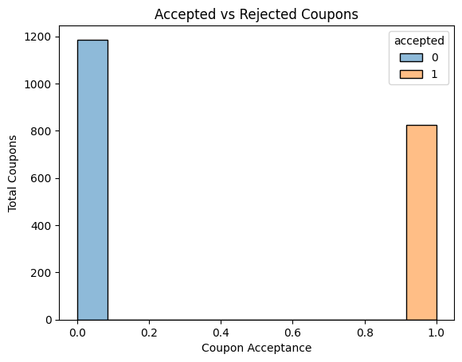

It appears that overall, drivers are more likely to reject a coupon than to accept it. Let's dig into the data to see what's influencing.

Starting with age.

```python
limited_only_bars['age'] = pd.Categorical(limited_only_bars['age'], categories=['below21', '21', '26', '31', '36', '41', '46', '50plus'], ordered=True)
sns.histplot(data=limited_only_bars, x='age', hue='accepted', multiple='stack')
plt.xlabel('Age')
plt.ylabel('Total Coupons')
plt.title('Coupon Acceptance by Age')
```

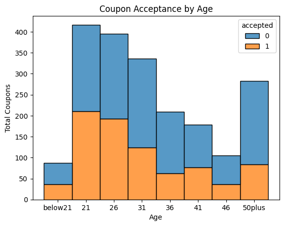

Seemingly stereotypical, but it looks like the acceptance rate starts high but drops off as the driver ages, with a few peaks in mid-life. The rejection rates increase as the person ages.

Let's look at these ages and compare other factors, starting with marital status.

```python
sns.histplot(data=limited_only_bars, x='age', hue='maritalStatus', multiple='stack')
plt.ylabel('Total Coupons')
plt.title('Marital Status by Age')
plt.xlabel('Age')
```

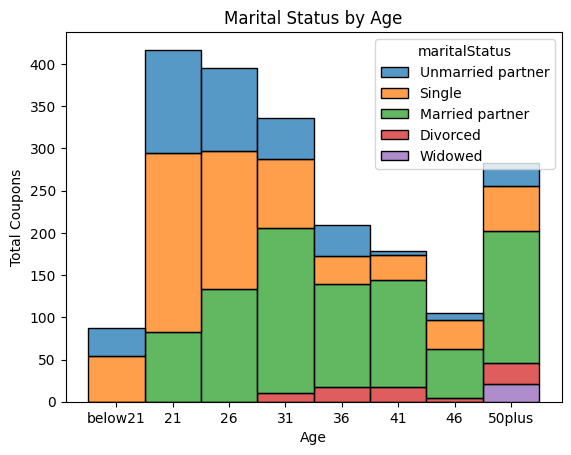

There's certainly a visual correlation to the increase in rejection rates as the driver is in some sort of relationship.

What about children?

```python
sns.histplot(data=limited_only_bars, x='age', hue='has_children', multiple='stack')
plt.ylabel('Total Coupons')
plt.title('Children by Age')
plt.xlabel('Age')
```

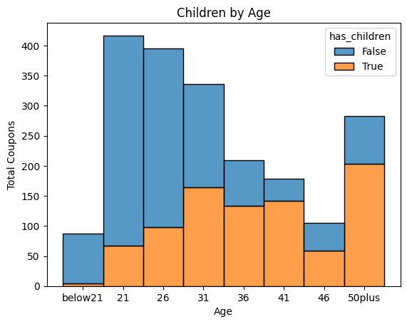

Again, as the driver has children, they are likely to reject these coupons. The exception appears to be as they age, this is likely because their children are grown. 

Let's look at passengers.

```python
sns.histplot(data=limited_only_bars, x='passanger', hue='accepted', multiple='stack')
```

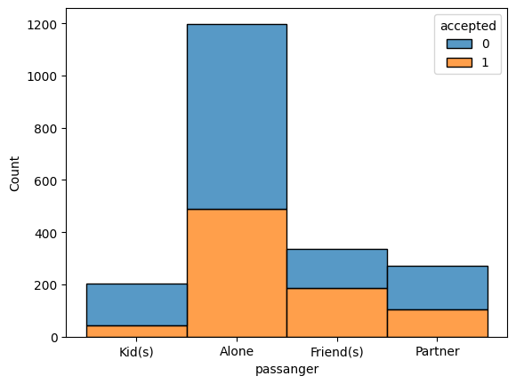

People driving alone are more likely to reject a coupon to go to a bar. However, if they were going to accept a coupon, those driving alone are more likely to do so than those who would have with passengers. Those with kids in the car are far less likely to accept a coupon, but some still do.

Let's look at distance and direction now.

```python
sns.histplot(data=limited_only_bars, x='direction_same', hue='accepted', multiple='stack')
```

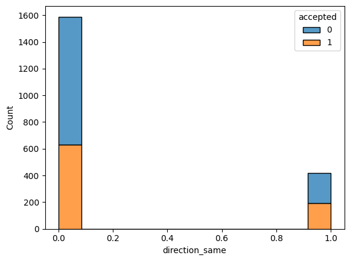

It looks like the driver is more likely to accept a coupon to a bar that is in the opposite direction than they are driving. However, the majority of coupons offered are in the opposite direction of the driver's destination.